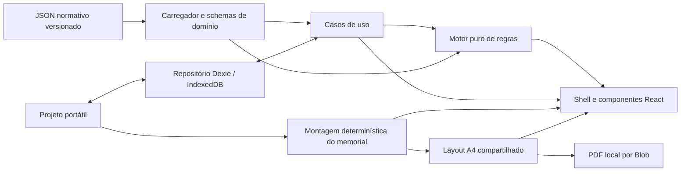

# Architecture

The application is layered to keep legal/normative decisions auditable and independent of the interface.

- `app`: application entry points and composition.
- `components`: reusable presentation; `components/ui` hosts shadcn-compatible primitives.
- `domain`: versioned business-neutral contracts and schemas.
- `rules`: funções puras de cálculo, consolidação e arredondamento, condicionadas à validação do dataset.
- `data/regulations`: datasets normativos versionados, com status de validação explícito.
- `storage`: local persistence adapters.
- `features`: use-case orchestration.
- `memorial`: geração local de narrativas e montagem estruturada do documento.
- `pdf`: paginação A4 determinística e desenho do arquivo final no navegador.
- `utils`: framework-agnostic helpers.

React components may present outcomes but must never contain normative criteria or scoring logic.

`calculateProjectScore` também entrega a projeção por requisito consumida pela interface. Ela reúne pontuação e vínculos documentais sem duplicar a resolução de critérios, tetos ou parâmetros do catálogo em componentes, memorial ou futuros geradores.

## Dependências entre camadas

| Camada             | Pode depender de                                                                  | Não pode depender de                                      |
| ------------------ | --------------------------------------------------------------------------------- | --------------------------------------------------------- |
| `domain`           | bibliotecas de schema e tipos neutros                                             | UI, casos de uso, datasets, regras, persistência, PDF     |
| `data/regulations` | `domain`                                                                          | UI, persistência e estado da aplicação                    |
| `rules`            | `domain` e dados recebidos por argumento                                          | React, casos de uso, IndexedDB, memorial e PDF            |
| `storage`          | `domain`                                                                          | React, regras, datasets, memorial e PDF                   |
| `memorial`         | `domain`                                                                          | React, regras, datasets, IndexedDB e PDF                  |
| `pdf`              | `domain` e representação semântica do memorial                                    | regras, datasets, IndexedDB e componentes                 |
| `features`         | domínio e adaptadores necessários ao caso de uso                                  | valores normativos copiados ou acesso remoto              |
| `components`/`app` | features, contratos e resultados prontos; composição dos adaptadores na fronteira | JSON normativo direto e implementação de regra de cálculo |

`tests/unit/architecture.test.ts` protege as fronteiras críticas e reprova acesso direto da
apresentação ao motor ou aos JSONs. Também reprova primitivas de rede e marcadores de implementação
incompleta em `src/`. Dependências que atravessam uma camada entram por contratos e argumentos
explícitos; não há registrador global de regra normativa.

## Fluxo de dados

O projeto editável é a fonte persistida. A pontuação é sempre derivada do projeto e do dataset
carregado e não volta ao IndexedDB como verdade normativa. Memorial e PDF consomem dados do projeto;
não consultam nem recalculam regras. A interface coordena essas saídas, sem conhecer fórmulas.

## Contratos e carregamento

`src/data/regulations/load.ts` carrega os três JSONs preenchidos e os metadados pelo schema genérico
de domínio. Alterações em valores e critérios dentro desse contrato exigem apenas editar os JSONs,
sem valores normativos em React. `provenance.issue` carrega conflitos como dados; nenhum código de
critério aparece no motor ou na interface. A validação estrutural ocorre nos testes e no carregamento.
O motor recebe envelope e dataset por argumento e recusa catálogos pendentes ou conflitantes.

## Motor quantitativo

`src/rules/scoring.ts` expõe `calculateActivity`, `roundFinalScore` e `calculateProjectScore`. O resultado discriminado está em `src/domain/scoring.ts` e inclui os dados necessários à apresentação de níveis, diretrizes, itens, tetos e requisitos. Cálculos usam aritmética decimal baseada em BigInt, sem arredondamento binário intermediário ou configuração global; conversões fora do intervalo de number retornam indisponibilidade explícita. Dados de entrada são validados e não são alterados.

A sequência é quantidade consolidada por critério → limite do item → fator e peso → soma/teto da diretriz → soma/teto do nível → total geral/arredondamento → mínimos. Pontuações não são persistidas nem incorporadas ao projeto como fonte de verdade.

## Projetos locais

`src/domain/local-project.ts` define ProjectRepository, LocalProject e SaveState. `src/storage/project-repository.ts` implementa CRUD, duplicação, revisão otimista e seleção ativa com Dexie/IndexedDB. `src/domain/portable-project.ts` valida o envelope e a representação JSON sem perdas.

`src/features/local-projects/` contém criação e arquivos portáteis, fila serial de autosave com debounce e coordenação da sessão de edição. O hook preserva rascunhos em falhas, conclui gravações antes de navegar e permite descartar explicitamente alterações não gravadas. Componentes apresentam lista, formulário de criação, editor JSON, estados e ações locais. A verificação de arquivos permanece independente da gravação; importar é uma ação explícita que sempre cria outra cópia.

A persistência não calcula pontuação, não valida referências normativas como oficiais e não contém regras normativas. Não há backend, autenticação, upload ou telemetria. Exportação usa Blob e download local.

## Shell e navegação

A etapa 04 substitui a tela única por um shell responsivo com React Router, sidebar e Sheet Radix. A sessão de persistência permanece acima das seções, preservando fila, revisão e rascunho durante a navegação. Rotas e projeções de preenchimento ficam em `features/project-shell`; componentes não contêm cálculos normativos.

Criação por nível/dataset usa o envelope 2.1 para representar campos inicialmente ausentes e versão normativa null. Os formatos anteriores continuam aceitos sem migração automática. A prévia textual fica em `src/memorial/`, separada do motor. Consulte `docs/frontend.md` para rotas e `docs/ux.md` para comportamento e limites.

## Montagem do memorial

`src/memorial/generator.ts` contém funções puras para gerar texto-base na sequência contexto → atuação → resultados → saberes/competências → enquadramento → comprovação, agrupar experiências nas seções editoriais e ordenar datas do passado para o presente. `src/memorial/preview.ts` monta capa, identificação, sumário e seções sem acessar React, armazenamento, rede ou motor quantitativo.

A última base fica em `Activity.generatedText`. Compará-la a uma nova geração detecta mudanças nos dados estruturados. Edição, aceite do texto atual e regeneração são operações explícitas e puras; somente a regeneração substitui `editedText`. O componente coordena essas operações e envia o projeto atualizado ao autosave existente.

## Pré-visualização e PDF

`src/pdf/layout.ts` transforma o documento semântico em páginas A4 usando as métricas da mesma
família tipográfica incorporada no arquivo. O resultado descreve linhas, posições, estilos,
margens, cabeçalhos e rodapés sem depender do DOM. A interface e o gerador consomem esse mesmo
layout, o que mantém iguais a ordem, as quebras e a paginação exibidas e baixadas.

`src/pdf/generator.ts` usa `pdf-lib` no navegador, incorpora fontes PDF padrão, desenha cada página
e inicia um download por Blob. Não há envio de dados, backend ou serviço de conversão. Caracteres
portugueses são preservados; símbolos não representáveis pela fonte são substituídos de modo
seguro para que conteúdo livre não interrompa a exportação. A camada não consulta nem implementa
regras normativas.

`src/pdf/evidence-bundle.ts` cria um plano ordenado por RSC, requisito e lançamento e percorre essa
mesma sequência para consolidar os PDFs e produzir o mapa de páginas. Comprovantes compartilhados
entram uma única vez e mantêm todos os vínculos no mapa derivado. O contrato neutro em
`src/domain/evidence-page-map.ts` informa o total e os intervalos inclusivos por comprovante e por
arquivo, podendo ser recebido posteriormente pelo memorial e por outros artefatos sem criar uma
dependência do gerador. Ausência, conteúdo inválido ou tipo incompatível produz diagnósticos por
arquivo e impede uma saída parcial. O resolvedor de bytes continua sendo recebido por contrato, sem
acesso direto ao IndexedDB.

O memorial recebe `EvidencePageMap` como projeção opcional em memória. A montagem semântica localiza
os comprovantes pelos vínculos de requisito e lançamento presentes no mapa e acrescenta suas
referências ao respectivo parágrafo, depois do texto autoral ou gerado. Prévia e download passam o
mesmo mapa à montagem compartilhada; números de página não entram no projeto nem são recalculados
pela camada de memorial.

`src/normative-documents/model.ts` projeta os Anexos II a VII do regulamento IFBA 189/2026 a partir
do projeto, do catálogo, do `CalculationResult` e do `EvidencePageMap`. A projeção não calcula
pontuação, não ordena comprovantes e não é persistida. Ela mantém ausências como campos vazios com
diagnósticos e transporta o estado validado, provisório ou indisponível entregue pelo domínio.
`src/pdf/normative-forms.ts` contém apenas o template visual e o download local, permitindo alterar
o desenho dos anexos sem mover regras para a camada PDF.

## Ponte incremental do domínio 3.0

Os schemas de critérios/ocorrências estão em `domain/criterion-entry.ts`; migração e projeção
compatível em `domain/project-migration.ts`. O motor aceita 3.0 e converte apenas sua entrada
para a representação quantitativa já testada. Continua agregando por critério, nunca por grupo,
e retorna occurrenceId nos campos activityId existentes para preservar consumidores.

A fronteira `ProjectSection` atualiza o projeto 3.0 diretamente. Não persiste Activity em paralelo.
Memorial e PDF recebem a projeção editorial em memória, com ordem e textos preservados; nenhuma
regra normativa foi acrescentada em React. O formulário é orquestrado em `features/requirements`.
`StoredFile` tem bytes locais resolvidos por `FileResolver`; descritores continuam portáteis e não
incluem os bytes no JSON.

## UX por nível e acompanhamento de backup

Uma única rota de Requisitos compõe abas RSC, busca, resultados e o formulário de lançamentos; o
componente não calcula pontos. O caso de uso cria ocorrências e evidências diretamente, sem
cadastro paralelo de trajetória ou tela separada de comprovantes.

`features/local-projects/backup-status.ts` calcula uma impressão SHA-256 do envelope normalizado.
`LocalProject.lastBackup` contém somente data e hash locais. O repositório grava esses metadados
em transação, preserva edições concorrentes e ignora conclusões de backups anteriores à marca
mais recente. A tabela `files` foi adicionada no Dexie v2, sem alterar projetos ou preferências.
Exportação de JSON continua independente da gravação dessa marca: falha de armazenamento não
desfaz o download já iniciado.

O backup restaurável em `features/local-projects/restorable-backup.ts` encapsula o envelope e os
blobs em `.rscflow`, com manifesto versionado e hashes. A leitura valida todo o contêiner antes de
entregar dados ao repositório; `createWithFiles` grava a nova cópia e seus arquivos na mesma
transação Dexie. O JSON portátil e o pacote de documentos mantêm contratos independentes.

A preparação de comprovantes em `features/final-documents/prepare.ts` reutiliza o plano e o
gerador existentes. A tela verifica a disponibilidade por projeto/resolvedor, descarta resultados
antigos e prepara novamente os arquivos ao gerar cada artefato. O download do consolidado usa os
mesmos bytes que originam o mapa, sem outra ordenação ou paginação.

`features/final-documents/generate-all.ts` coordena a geração conjunta sobre uma cópia imutável dos
dados estruturados. A consolidação termina antes de iniciar os geradores dependentes, que recebem a
mesma instância de `EvidencePageMap`. O resultado só expõe os bytes dos três artefatos quando todos
terminam; em falha, expõe apenas o estado produzido, falho ou não iniciado de cada etapa.

`features/final-documents/package.ts` recebe exclusivamente o resultado completo dessa operação,
valida os três PDFs e os grava sem alteração em um ZIP determinístico. Nomes vêm das mesmas funções
usadas nos downloads individuais. A camada de pacote não conhece templates, não recalcula dados e
não chama geradores.
